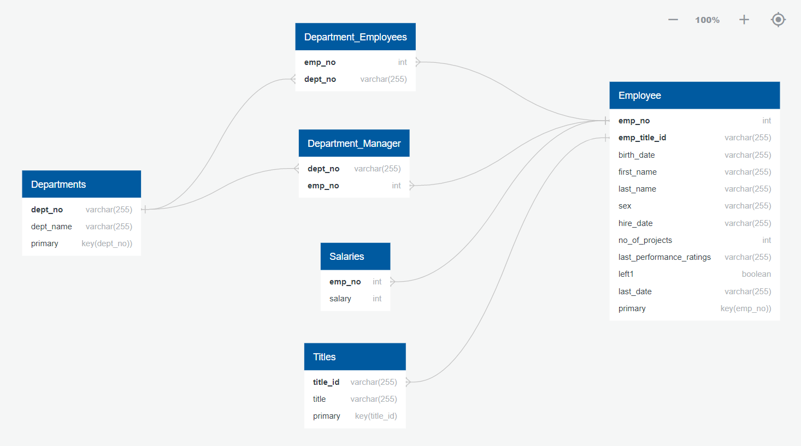

# EMPLOYEE-CAPSTONE

## Introduction:-
You have been hired as a new data engineer at Analytixlabs. Your first major task is to work on data engineering project for one of the big corporation’s employees data from the 1980s and 1995s. All the database of employees from that period are provided six CSV files. In this project, you will design data model with all the tables to hold data, import the CSVs into a SQL database, transfer SQL database to HDFS/Hive, and perform analysis using Hive/Impala/Spark/SparkML using the data and create data and ML pipelines.

## Data Modeling
Inspect the CSVs and sketch out an ERD of the tables.

## Data Engineering
Use the information you have to create a table schema for each of the six CSV files.

Import each CSV file into the corresponding SQL table.

--Given a dataset of employees at a company, a data model was created after inspecting the files the dataset comprises and modelled with an ERD diagram. A table schema was then devised using the ERD so that the data could be loaded into SQL for further analysis.--

## ANALYSIS ON DATA
A sample analysis of 12 questions on the dataset was done, which were:

1.List the following details of each employee: employee number, last name, first name, sex, and salary.

2.List first name, last name, and hire date for employees who were hired in 1986.

3.List the manager of each department with the following information: department number, department name, the manager's employee number, last name, first name.

4.List the department of each employee with the following information: employee number, last name, first name, and department name.

5.List first name, last name, and sex for employees whose first name is "Hercules" and last names begin with "B."

6.List all employees in the Sales department, including their employee number, last name, first name, and department name.

7.List all employees in the Sales and Development departments, including their employee number, last name, first name, and department name.

8.In descending order, list the frequency count of employee last names, i.e., how many employees share each last name.

9.Histogram to show the salary distribution among the employees.

10.Bar graph to show the Average salary per title (designation).

11.Calculate employee tenure & show the tenure distribution among the employees.

12.Bonus questions
